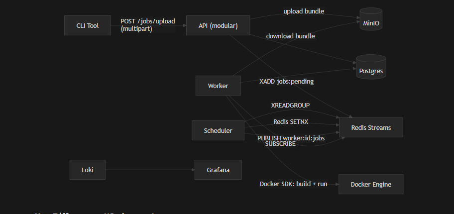

# Distributed Job Scheduler

A Python-based distributed job scheduler that accepts jobs (arbitrary Python scripts with dependencies), schedules them on worker nodes, runs them in containers with cached environments, and provides durability, HA leader election, retries, and observability.

## Overview

Submit Python scripts with their `requirements.txt`. The system automatically:
- Stores job bundles in MinIO (S3-compatible artifact store)
- Builds and caches Docker images with the required dependencies
- Bind-mounts your script into the cached environment
- Runs jobs across distributed workers with retry and recovery

## Tech Stack

* **Language:** Python 3.9+
* **API:** FastAPI
* **Job Queue:** Redis Streams
* **State Store:** PostgreSQL
* **Artifact Store:** MinIO
* **Leader Election:** Redis SETNX
* **Container Runtime:** Docker (via Python SDK)
* **Orchestration:** Docker Compose (dev) / Docker Swarm (prod)
* **Observability:** Prometheus, Grafana, Loki

##  Architecture 



## Key Features

- **Arbitrary Script Execution:** Upload any Python script with a `requirements.txt`
- **Environment Caching:** Docker images built per unique `requirements.txt` hash, reused across jobs
- **Automatic Retries:** Failed jobs retry with configurable limits
- **HA Scheduler:** 3 replicas with Redis-based leader election; failover in <10s
- **Crash Recovery:** Dead worker detection and automatic job re-enqueue
- **CLI Tool:** `scheduler submit`, `scheduler status`, `scheduler logs`
- **Observability:** Prometheus metrics, Grafana dashboards, Loki log aggregation

## Quick Start

1.  **Prerequisites:** Docker, Docker Compose, Python 3.9+
2.  **Start Infrastructure:**
    ```bash
    docker-compose up -d --build
    ```
3.  **Submit a job via CLI:**
    ```bash
    pip install -e .
    scheduler submit --script ./my_script.py --requirements ./requirements.txt
    ```
4.  **Or submit via API:**
    ```bash
    curl -X POST http://localhost:8000/jobs/upload \
      -F "script=@./my_script.py" \
      -F "requirements=@./requirements.txt"
    ```
5.  **Access Services:**
    *   API: http://localhost:8000
    *   MinIO Console: http://localhost:9001
    *   Prometheus: http://localhost:9090
    *   Grafana: http://localhost:3000
    *   Loki: http://localhost:3100

## Documentation

For detailed setup instructions, see [setup-instructions.md](./setup-instructions.md).

## Notes:

Docker Swarm Deployment is not tested for production deployment  !!!!!!!


