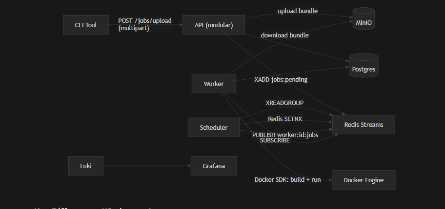

# Distributed Job Scheduler

A Python-based distributed job scheduler that accepts jobs (arbitrary Python scripts with dependencies), schedules them on worker nodes, runs them in sandboxed containers with cached environments, and provides durability, HA leader election, retries, and observability.

It is designed for both humans and AI agents: submit a script, let it run on a worker, then poll for the status and fetch the result without keeping the work in memory.

## Overview

Submit Python scripts with their `requirements.txt`. The system automatically:
- Stores job bundles in MinIO (S3-compatible artifact store)
- Builds and caches Docker images with the required dependencies
- Bind-mounts your script into the cached environment
- Runs jobs across distributed workers with retry and recovery
- Captures each job's output so it can be retrieved later via the CLI or API

## Tech Stack

* **Language:** Python 3.9+
* **API:** FastAPI
* **Job Queue:** Redis Streams
* **State Store:** PostgreSQL
* **Artifact Store:** MinIO
* **Leader Election:** Redis SETNX
* **Container Runtime:** Docker (via Python SDK)
* **Orchestration:** Docker Compose (dev) / Docker Swarm (prod)
* **Observability:** Prometheus, Grafana, Loki

##  Architecture 



## Key Features

- **Arbitrary Script Execution:** Upload any Python script with a `requirements.txt`
- **Environment Caching:** Docker images built per unique `requirements.txt` hash, reused across jobs
- **Sandboxed by Default:** Jobs run in network-isolated, read-only containers; opt into internet access per job with `--network`
- **Automatic Retries:** Failed jobs retry with configurable limits
- **HA Scheduler:** 3 replicas with Redis-based leader election; failover in <10s
- **Crash Recovery:** Dead worker detection and automatic job re-enqueue
- **CLI Tool:** `scheduler submit`, `scheduler status --watch`, `scheduler logs`, `scheduler list`
- **AI Agent Friendly:** Agents submit a script, poll status until it finishes, and read the captured result; long-running work runs off-context
- **Observability:** Prometheus metrics, Grafana dashboards, Loki log aggregation

## Quick Start

1.  **Prerequisites:** Docker, Docker Compose, Python 3.9+
2.  **Start Infrastructure:**
    ```bash
    docker-compose up -d --build
    ```
3.  **Submit a job via CLI:**
    ```bash
    pip install -e .
    scheduler submit --script ./Trials/test_script.py --requirements ./Trials/test_requirements.txt
    ```
    Then watch it run to completion and read its output:
    ```bash
    scheduler status <job_id> --watch
    scheduler logs <job_id>
    ```
    By default jobs run with no network access (sandboxed). Pass `--network` if the
    script needs internet (API calls, downloads):
    ```bash
    scheduler submit -s ./Trials/test_script.py -r ./Trials/test_requirements.txt --network
    ```
4.  **Or submit via API:**
    ```bash
    curl -X POST http://localhost:8000/jobs/upload \
      -F "script=@./Trials/test_script.py" \
      -F "requirements=@./Trials/test_requirements.txt"
    ```
5.  **Access Services:**
    *   API: http://localhost:8000
    *   MinIO Console: http://localhost:9001
    *   Prometheus: http://localhost:9090
    *   Grafana: http://localhost:3000
    *   Loki: http://localhost:3100

## For AI Agents

An agent can hand off a script and collect the result later instead of holding the work in its context window:

```bash
# 1. Submit the script the agent generated (and optional requirements)
scheduler submit --script ./my_script.py --requirements ./requirements.txt

# 2. Block until the job reaches a terminal state (SUCCESS / FAILED / DEAD)
scheduler status <job_id> --watch

# 3. Read the captured output
scheduler logs <job_id>
```

Add `--network` to the submit command when the script needs internet access. This lets an agent verify generated code runs correctly and read back stdout/stderr and the exit code, all through the CLI.

## Documentation

For detailed setup instructions, see [setup-instructions.md](./setup-instructions.md).

## Notes

The Docker Swarm configuration is provided as a reference and has not been validated for production deployment.


